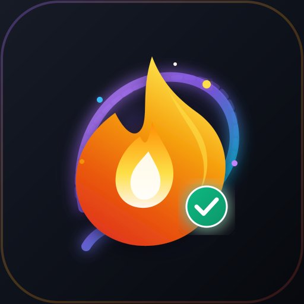

<div align="center">

  

  # ⚡ StreakFlow

  **A Sleek, Offline-First Personal Habit Streak & Behavioral Consistency Tracker**

  [](https://flutter.dev)
  [](https://dart.dev)
  [](https://riverpod.dev)
  [](https://pub.dev/packages/hive)
  [](LICENSE)

  [Features](#-key-features) • [Tech Stack](#-technology-stack) • [Architecture](#-architecture) • [Getting Started](#-getting-started) • [Documentation](Details.md)

</div>

---

## 🌟 Overview

**StreakFlow** is a modern, privacy-focused, offline-first habit tracking mobile application designed around the psychological principle of **loss aversion**. Built with Flutter and Riverpod, StreakFlow helps users build long-term daily habits—such as coding, workout routines, reading, and meditation—by leveraging gamified streak mechanics, visual flame tiers, milestone rewards, and interactive analytics.

---

## 🔥 Key Features

### 1. 🏆 Loss Aversion & Gamified Streak Tiers
StreakFlow motivates consistency through dynamic Snapchat & Duolingo-style visual flame tiers:
* 🟢 **1–6 Days**: Ember Flame (`🔥`)
* 🟣 **7–29 Days**: Plasma Flame (`💜🔥`) — *First Spark Badge*
* 🔱 **30–49 Days**: Golden Crown (`🔱🔥`) — *Monthly Warrior Badge*
* 💎 **50–99 Days**: Diamond Cyan (`💎🔥`) — *Half-Century Legend Badge*
* 👑 **100+ Days**: Mythic Ruby (`👑🔥`) — *Centurion Master Badge*
* 🧊 **Streak Freeze Shields**: Protect active streaks during unexpected emergencies or busy days.
* ⚠️ **"Streak at Risk!" Warning Banner**: Automatically alerts users in the evening for uncompleted active streaks.

### 2. 🎨 Dynamic Theme Engine & Multiple Accents
* **Light Theme Mode**: Warm off-white surface backgrounds (`#FFF9F2`), soft borders (`#F0E4D4`), and high contrast typography.
* **Dark Theme Mode**: Deep dark surface canvas (`#0B0E14`), surface elevation (`#161B26`), and vibrant accents.
* **System Mode**: Follows system-wide dark/light preferences automatically.
* **4 Accent Swatches**: Dynamic theme customization with **Cyber Violet** (`#8B5CF6`), **Neon Emerald** (`#10B981`), **Solar Amber** (`#F59E0B`), and **Midnight Ruby** (`#EF4444`).

### 3. 📊 Analytics & Interactive Calendar
* **Monthly Grid Heatmap**: Interactive month switcher (`‹ August 2026 ›`) with freeze markers and completion history overlays.
* **Day-of-Week Analytics Chart**: Monday–Sunday completion breakdown chart highlighting peak performance days.
* **Milestone Badges Sheet**: Progress tracking for 7, 30, 50, and 100-day milestone unlock cards with celebration confetti dialogs.

### 4. 👤 User Profile & Customization
* Personalize name, age, short bio, main habit goal, and custom profile avatar via `image_picker`.
* Profile avatar synced across top app header and profile screens.

### 5. 🔍 Search, Multi-Mode Sorting & Emoji Input
* Real-time search filter by habit title.
* Multi-mode sorting (*Default*, *Uncompleted First*, *Highest Streak*, *Longest Record*, *Alphabetical*).
* Custom Emoji Picker Keyboard + Quick preset chips.

### 6. 🔒 100% Local & Privacy-First Data Management
* **Offline Storage**: Powered by Hive NoSQL database and SharedPreferences. Zero external tracking or required cloud login.
* **JSON Backup & Restore**: One-tap export of full habit data to clipboard and instant JSON import restoration.
* **Local Evening Reminders**: Daily notifications scheduled via `flutter_local_notifications`.

---

## 🛠️ Technology Stack

| Layer | Technology / Package | Purpose |
| :--- | :--- | :--- |
| **Framework** | Flutter (Dart `^3.10.3`) | Cross-platform mobile app SDK |
| **State Management** | `flutter_riverpod ^2.5.1` | Reactive, compile-safe state providers |
| **Local Database** | `hive ^2.2.3` & `hive_flutter` | Lightweight, blazingly fast NoSQL key-value database |
| **Key-Value Store** | `shared_preferences ^2.5.5` | User preferences, theme settings, profile data |
| **Vector Graphics** | `flutter_svg ^2.0.10` | High-res SVG rendering for logos & brand iconography |
| **Typography** | `google_fonts ^6.1.0` | Inter font typography scale |
| **Media Selection** | `image_picker ^1.2.3` | User profile avatar photo selection |
| **Local Alerts** | `flutter_local_notifications ^17.0.0` | Scheduled daily push notifications |

---

## 🏗️ Architecture

StreakFlow follows a clean, modular **Layered Architecture**:

```text
+---------------------------------------------------------------------------------+
|                                PRESENTATION LAYER                               |
| SplashScreen | HomeScreen | StatsScreen | ProfileScreen | SettingsDataScreen   |
| InteractiveMonthlyCalendar | WeekdayAnalyticsChart | MilestoneBadgesSheet       |
| HabitCard | CelebrationDialog | GlassmorphicStreakSummaryCard                   |
+---------------------------------------------------------------------------------+
                                      | (Riverpod Ref & Theme Extensions)
                                      v
+---------------------------------------------------------------------------------+
|                                DESIGN SYSTEM & THEMES                           |
| AppColors | AppColorScheme (Light & Dark) | AppTypography (Inter) | AppRadius    |
| AppSpacing | AppAccent (Cyber Violet, Neon Emerald, Solar Amber, Midnight Ruby) |
+---------------------------------------------------------------------------------+
                                      | (Riverpod State)
                                      v
+---------------------------------------------------------------------------------+
|                                APPLICATION LAYER                                |
| HabitsNotifier (StateNotifier) | UserProfileNotifier | AccentThemeNotifier      |
| ThemeModeNotifier | Search & Sort Providers                                    |
+---------------------------------------------------------------------------------+
                                      | (CRUD, Persistence & Streak Logic)
                                      v
+---------------------------------------------------------------------------------+
|                              DATA & DOMAIN LAYER                                |
| Habit Model (@HiveType) | UserProfile Model | Hive Box<Habit> | SharedPreferences |
| NotificationService | BackupService                                             |
+---------------------------------------------------------------------------------+
```

---

## 📂 Project Directory Structure

```text
streak_app/
├── assets/
│   └── images/
│       ├── app_logo.svg         # Clean vector brand logo
│       └── app_logo.png         # High-res 512x512 PNG app icon
├── lib/
│   ├── main.dart                # App entry point & Hive initialization
│   ├── models/                  # Hive TypeAdapters & Data Classes
│   │   ├── habit.dart
│   │   └── user_profile.dart
│   ├── providers/               # Riverpod StateNotifiers & Providers
│   │   ├── habit_provider.dart
│   │   ├── theme_provider.dart
│   │   └── user_profile_provider.dart
│   ├── screens/                 # Application Screens
│   │   ├── splash_screen.dart
│   │   ├── home_screen.dart
│   │   ├── stats_screen.dart
│   │   ├── profile_screen.dart
│   │   └── settings_data_screen.dart
│   ├── services/                # Backup, Notifications & Utilities
│   │   ├── backup_service.dart
│   │   └── notification_service.dart
│   ├── theme/                   # Dynamic Theme System
│   │   ├── app_colors.dart
│   │   ├── app_accent.dart
│   │   ├── app_typography.dart
│   │   ├── app_radius.dart
│   │   ├── app_spacing.dart
│   │   └── streak_tiers.dart
│   └── widgets/                 # Reusable UI Components
│       ├── habit_card.dart
│       ├── milestone_badges_sheet.dart
│       └── celebration_dialog.dart
├── Details.md                   # Full Technical Project Documentation
└── pubspec.yaml                 # Dependencies & asset declarations
```

---

## ⚡ Getting Started

### Prerequisites
* [Flutter SDK](https://flutter.dev) (`>=3.10.3`)
* Dart SDK (`^3.0.0`)
* Android Studio / VS Code with Flutter extensions

### Build & Run Instructions

1. **Clone the Repository:**
   ```bash
   git clone https://github.com/your-username/streak_app.git
   cd streak_app
   ```

2. **Install Dependencies:**
   ```bash
   flutter pub get
   ```

3. **Generate Hive Adapters (If modifying models):**
   ```bash
   flutter pub run build_runner build --delete-conflicting-outputs
   ```

4. **Generate Native Launcher Icons (Optional):**
   ```bash
   dart run flutter_launcher_icons
   ```

5. **Run the Application:**
   ```bash
   flutter run
   ```

---

## 📄 Documentation

For exhaustive technical documentation, data models, state flow diagrams, loss aversion psychology specs, and submission guidelines, see [`DETAILS.md`](DETAILS.md).

---

## 📜 License

This project is open-source under the [MIT License](LICENSE).
